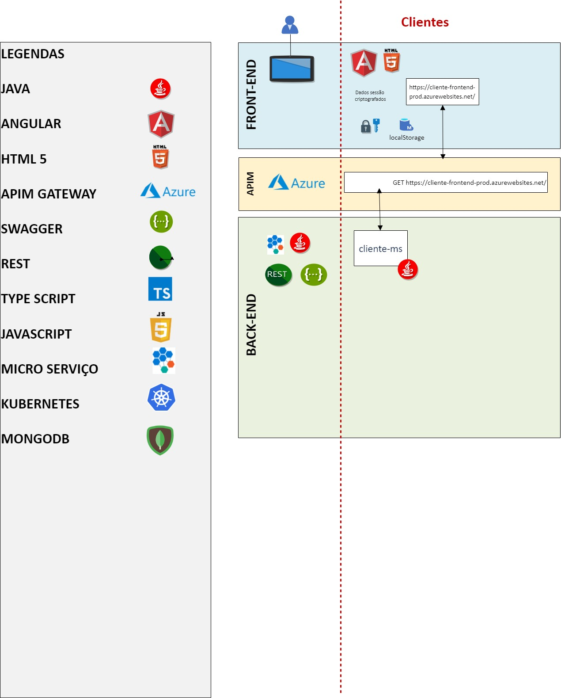

# Cliente MS
### Objetivo da história:

A área de relacionamento com o cliente da nossa empresa possui interesse em gerenciar clientes e seus respectivos dados sensíveis (nome, cpf e telefone para contato) através de uma aplicação web. Para isso, precisamos cadastrar os clientes, para que possamos buscá-los através de suas informações.

### Objetivo do Serviço:
Serviço para processar as entradas de clientes, contemplando os diversos cenários desta tarefa.

O nosso time interno de produto, responsável pela integração com outros squad's de desenvolvimento, já nos informou a necessidade de consultar as informações do cliente através de outro subsistema.

## Arquitetura Projeto


### Pré-requisitos p/ build
- Linux (Debian/Ubuntu based)
- JDK 11

### Adicionais para usuários windows (untested)
- [make](https://chocolatey.org/packages/make)
- [bash](https://gitforwindows.org)

### Quick start
Utilizamos o [make](https://www.gnu.org/software/make) para as tarefas de dev, CI/CD
```sh
# mostra a ajuda com todas as opções disponíveis
> make help
# executar o projeto sem o make 
> ./mvnw spring-boot:run
# executar testes sem o make 
> mvn test
```

### Para execução local é necessario adicionar as váriaveis de ambiente
```sh
- SPRING_DATASOURCE_URL
- SPRING_DATASOURCE_USERNAME
- SPRING_DATASOURCE_PASSWORD
```

## Build

Execute `mvn clean package` `mvn install` para fazer o build do projeto. Serão armazenados no diretório `target` dentro da pasta do projeto.


### Estrutura do projeto

```
project
│   README.md    
 ```   

### Pastas
- **src**: Pasta src contendo o código fonte projeto .
- **util**: Contem arquivos utilitarios do projeto jenkinsfile , dockerfile e etc.
- **docker**: Arquivos relacionados ao docker do projeto;
- **test**: Testes unitários e de integração do projeto é a fase do teste de software em que os módulos são testados individualmente integrado.

### Rodar os testes automatizados local.
    - Necessário a geração da chave ssh do usuario do bitbucket
    - Instalar o ruby versão 2.5
    - Executar o arquivo /test/ruby/_run.ci.sh


### Criar ambiente para Deploy no K8S

crie os seguintes recursos no rancher:

- Namespace: "cliente-ms-dev"
- ConfigMap: "cliente-ms-cfg"
- SecretMap: "cliente-ms-secret"

Obs.: exemplos de configMap e SecretMap mínimos para o deploy da app [aqui](./util/docs/k8s/ap-results-api)

## Documentação Swagger

Documentação Swagger através do arquivo [JSON File](./src/main/resources/swagger/swagger.json).

Link da interface gráfica da aplicação para o Swagger UI no ambiente de [DEV](http://localhost:9080/swagger-ui.html).
> Para utilização em outro ambiente deverá utilizar o IP do servidor: `http://IP_SERVIDOR:9080/swagger-ui.html`